# IPRD ERP System - MVP Demo Document

**Government of Bihar - Information & Public Relations Department**  
**Content Management & Digital Archive System**

---

## Executive Summary

The IPRD ERP System is a complete web-based solution for managing government content. It helps departments upload, organize, search, and share videos, photos, documents, and reports in one place. The system is designed for easy use by government staff at all levels.

**Key Benefits:**
- One place for all government content
- Easy search and filter options
- Role-based access for different users
- Complete audit trail of all actions
- Works on desktop and mobile devices

> Note: This document showcases a basic UI-only MVP to share the concept and flow. Backend services and database integration will be implemented after the UI is finalized.

---

## 1. Login & Authentication

The system provides secure login with role-based access. Users can select from six different roles, each with specific permissions.

**Roles Available:**
- Super Admin (full access)
- Department Admin
- District Officer
- Block Officer
- Staff
- Viewer (read-only)

*Figure 1: Login page showing Bihar government logo, "IPRD ERP | Beta" branding, and role selection dropdown with six user roles.*

---

## 2. Dashboard

The dashboard provides a complete overview of system activity. It shows key metrics, recent uploads, and top tags used across the system.

**Key Metrics:**
- Total uploads count
- Total searches performed
- Total shares completed
- Cloud vs Local storage breakdown
- Top tags with usage counts
- Recent uploads table

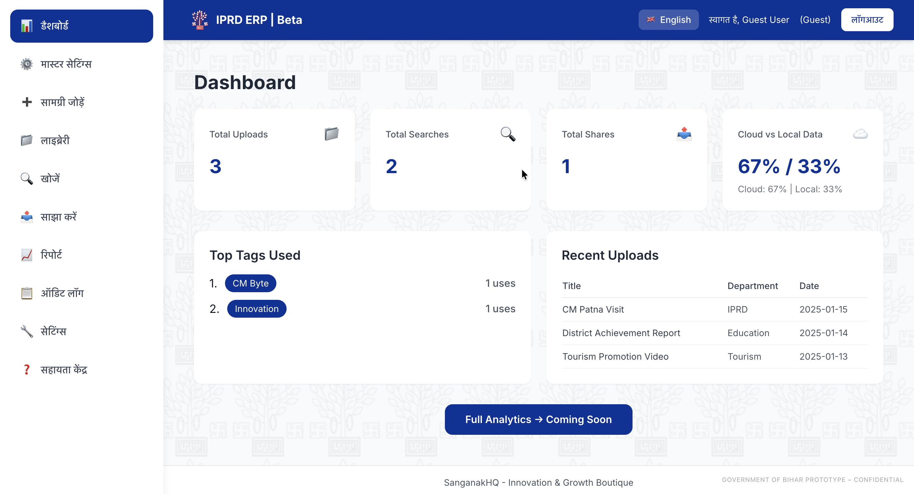

*Figure 2: Dashboard overview showing key metrics (Total Uploads, Searches, Shares, Cloud vs Local), Top Tags section, and Recent Uploads table.*

---

## 3. Content Upload

Users can upload multiple file types including videos, photos, documents, reports, and ZIP archives. The system automatically detects file type and extracts metadata like duration, dimensions, and file size.

**Supported Formats:**
- Videos: MP4, AVI, MOV, WMV, FLV, WebM, MKV, and more
- Images: JPG, PNG, GIF, BMP, WebP, SVG, TIFF, and more
- Documents: PDF, DOC, DOCX, XLS, XLSX, PPT, PPTX, and more
- Archives: ZIP, RAR, 7Z, TAR, GZ, and more

**Features:**
- Automatic file type detection
- Metadata extraction (duration, size, dimensions)
- ZIP file content preview
- Storage source selection (Cloud or Local Network)
- File size validation (100MB limit)

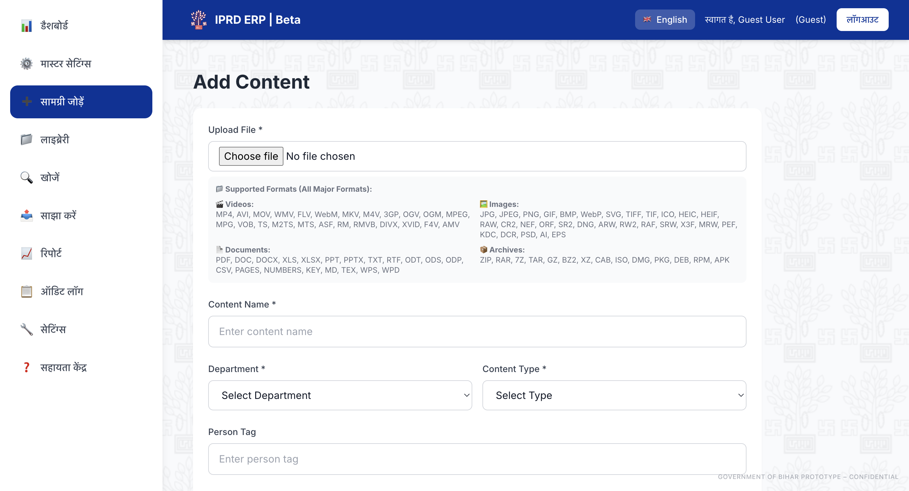

*Figure 3: Add Content page showing file upload interface with automatic metadata extraction (file size, duration, dimensions) and complete form with department, district, block, and storage source selection.*

---

## 4. Video Library - 3-Phase Workflow

The video library manages videos through three phases: Raw → Editing → Final.

**Phase 1 (Raw):** Newly uploaded videos start as "Raw" and are pending editing.

**Phase 2 (Editing):** Videos can be tagged with specific time ranges and categories like Best Practice, Innovation, Achievement, etc.

**Phase 3 (Final):** Processed videos with tags are marked as "Final" and can be shared as complete files or clips.

*Figure 4: Video Library showing 3-phase workflow (Raw → Editing → Final) with video player, tag form for adding timestamps, and tag categories.*

---

## 5. Library - All Content Types

The library provides a unified view of all uploaded content. Users can filter by content type (All, Videos, Photos, Documents, Reports) and view content in a grid layout.

**Features:**
- Filter by content type
- View metadata (duration, size, dimensions)
- Status badges (Raw/Final)
- Quick actions (View/Share)
- ZIP file indicators

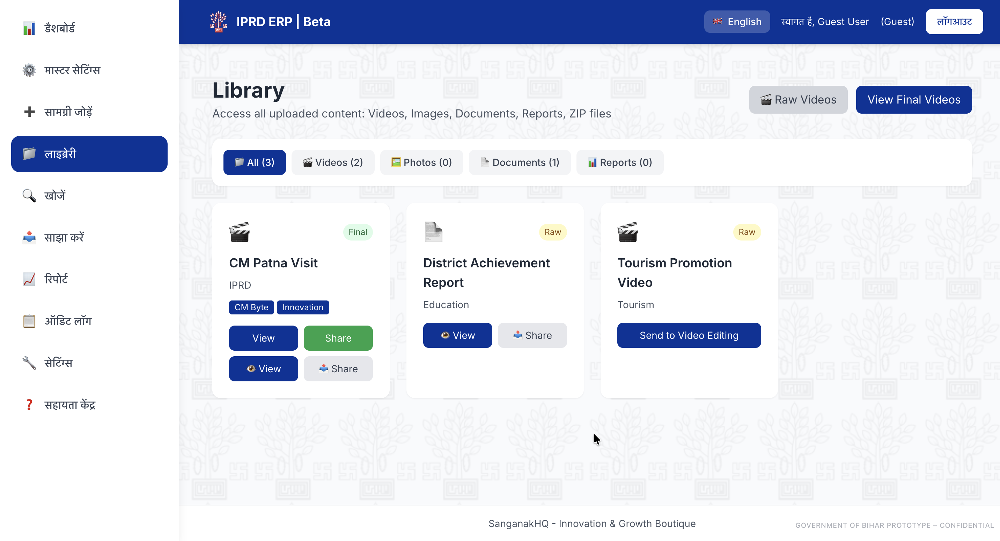

*Figure 5: Library view showing content type filters (All, Videos, Photos, Documents, Reports) and content grid with cards displaying metadata, status badges, and action buttons.*

---

## 6. Advanced Search & Filtering

The search system allows users to find content quickly using multiple filters. Users can search by text, department, district, block, content type, person tag, tag type, and year range.

**Search Features:**
- Real-time text search
- Multiple filter combinations
- Grid and table view options
- ZIP file viewer for archives

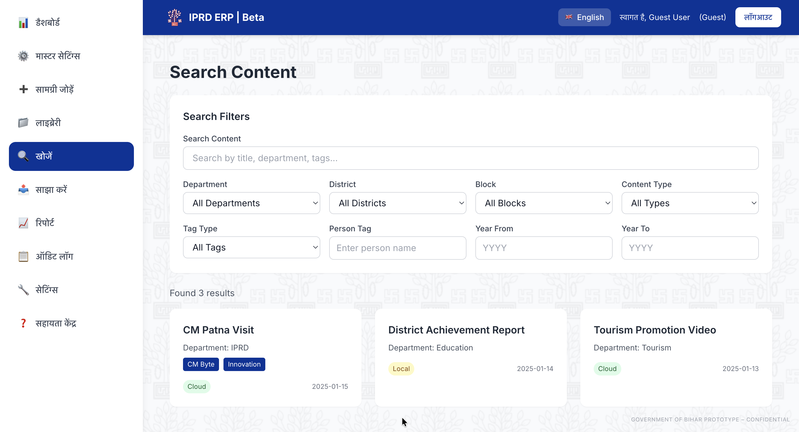

*Figure 6: Advanced Search page with multiple filter options (department, district, block, content type, person tag, tag type, year range) and search results displayed in grid format.*

---

## 7. Content Sharing

Users can share complete files or specific video clips with timestamps. The system generates share links and tracks sharing activity.

**Sharing Options:**
- Share complete file
- Share video clip (specific time range)
- Generate share links
- Track sharing activity

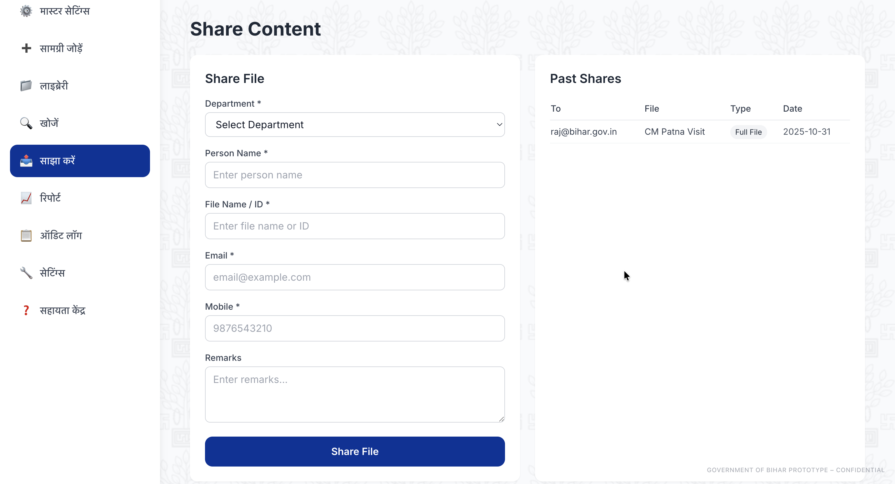

*Figure 7: Share Content page showing sharing interface with options to share complete files or video clips with specific timestamp ranges.*

---

## 8. Master Settings

Administrators can manage system master data including Departments, Districts, Blocks, and Roles. Full CRUD (Create, Read, Update, Delete) functionality is available for each category.

**Manageable Items:**
- Departments (Add/Edit/Delete)
- Districts (Add/Edit/Delete)
- Blocks (Add/Edit/Delete)
- Roles (Add/Edit/Delete)

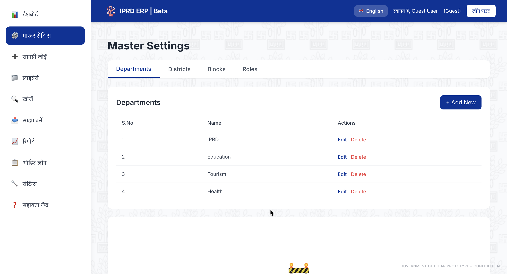

*Figure 8: Master Settings page with tabs for Departments, Districts, Blocks, and Roles, showing full CRUD functionality (Create, Read, Update, Delete) for each category.*

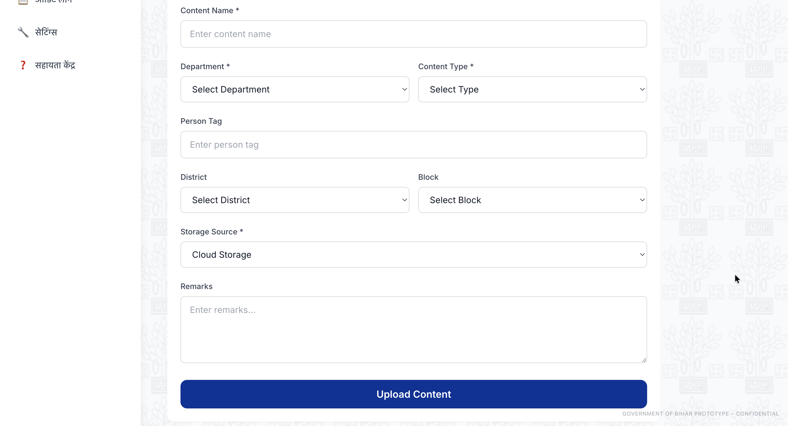

*Figure 8b: Additional view of Master Settings showing Edit/Delete flows and validation.*

---

## 9. Reports & Analytics

The reports section provides visual analytics and export options. Users can view charts showing department-wise distribution, content type distribution, monthly trends, and department comparisons.

**Available Charts:**
- Department-wise content distribution (Pie Chart)
- Content type distribution (Pie Chart)
- Monthly upload trends (Line Chart)
- Department upload comparison (Bar Chart)

**Export Options:**
- Export to CSV format
- Export to JSON format
- Date range filtering

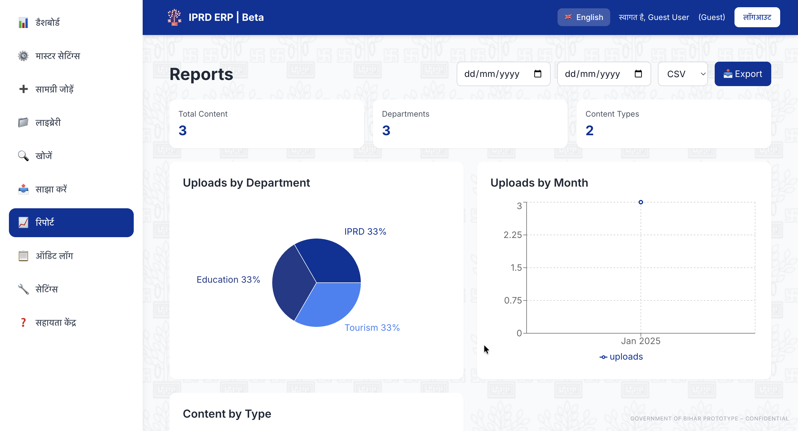

*Figure 9: Reports & Analytics page showing visual charts (Department Distribution Pie Chart, Content Type Distribution, Monthly Upload Trends Line Chart, Department Comparison Bar Chart) and export options (CSV/JSON).*

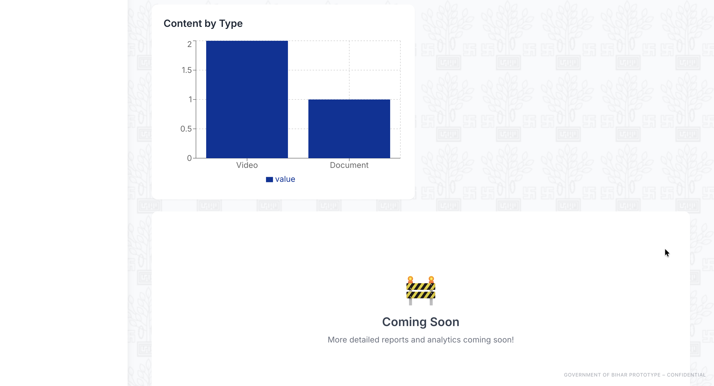

*Figure 9b: Reports export options (CSV/JSON) and date range filters in action.*

---

## 10. Audit Logs

All user actions are tracked and logged for security and compliance. Each log entry includes action type, content name, user who performed the action, timestamp, and additional details.

**Tracked Actions:**
- Content uploads
- Content searches
- Content shares
- Settings changes
- User logins

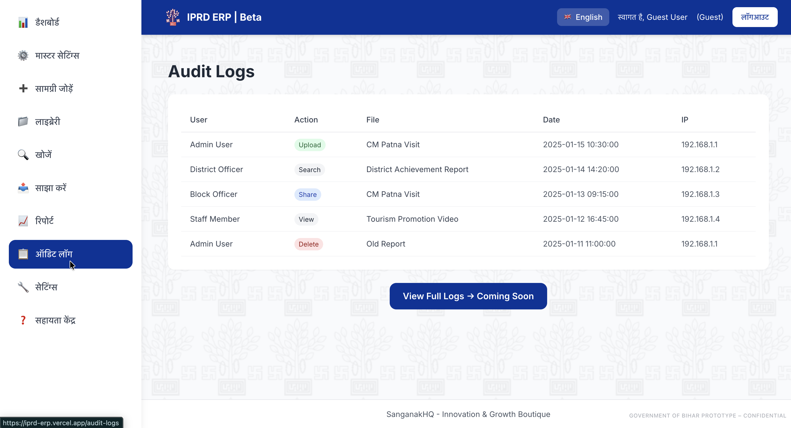

*Figure 10: Audit Logs page showing complete activity tracking with timestamps, user information, action types, and content details for all system activities.*

---

## 11. Settings & Preferences

Users can manage their account settings including password change, language preference (Hindi/English), and notification settings.

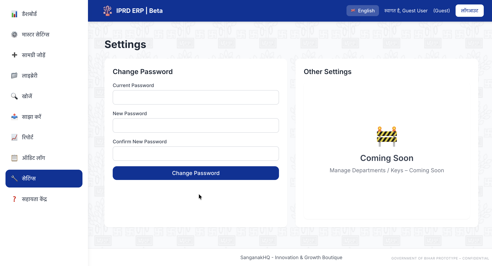

*Figure 11: Settings page showing user preferences including password change form, language selection (Hindi/English), and notification settings.*

---

## 12. Mobile Responsiveness

The system is fully responsive and works on all device sizes. The sidebar collapses on mobile, buttons are touch-friendly, and all features are accessible.

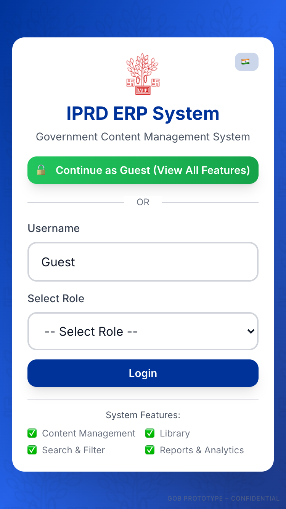

*Figure 12: Mobile responsive view showing collapsed sidebar with hamburger menu, touch-friendly interface, and optimized layout for mobile devices.*

---

## 13. Bilingual Support

The system supports both Hindi and English languages. Users can toggle between languages using the language selector.

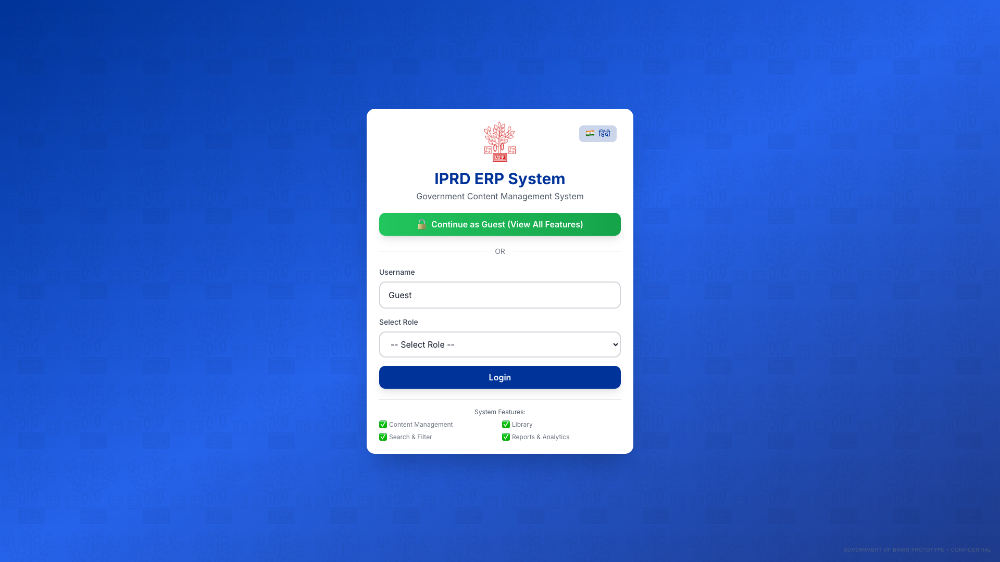

*Figure 13: Bilingual support showing language toggle button (Hindi/English) and interface elements in selected language for accessibility.*

---

## 14. Professional Branding

The system features professional government branding including the Bihar logo in the top-left, "IPRD ERP | Beta" title, and a watermark "Government of Bihar Prototype – Confidential" in the bottom-right corner.

*Figure 14: Professional government branding showing Bihar logo in top-left, "IPRD ERP | Beta" title, and "Government of Bihar Prototype – Confidential" watermark in bottom-right corner.*

---

## 15. Help Center

The Help Center provides quick guidance, FAQs, and short tutorials to help users get started and resolve common issues.

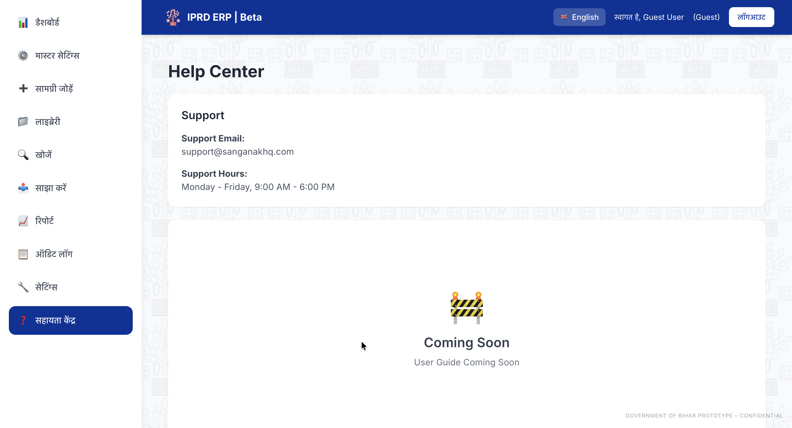

*Figure 15: Help Center page with user guide links, FAQs, and tips.*

---

## Technical Highlights

### User Interface
- Clean and modern design
- Responsive layout for all devices
- Professional color scheme
- Intuitive navigation
- Loading states and toast notifications

### Performance
- Fast page loading
- Smooth transitions
- Efficient search with real-time filtering
- Optimized file handling

### Security
- Role-based access control
- Complete audit trail
- Secure data storage options
- Access restrictions for local files

### Browser Compatibility
Works on all modern browsers: Chrome, Firefox, Safari, Edge

---

## Key Features Summary

1. **Role-Based Access Control** - Six user roles with different permissions
2. **Content Management** - Upload videos, photos, documents, reports
3. **Video Library** - 3-phase workflow with tagging
4. **Advanced Search** - Multiple filters and real-time search
5. **Content Sharing** - Share files or video clips
6. **Master Settings** - Manage departments, districts, blocks, roles
7. **Reports & Analytics** - Visual charts and export options
8. **Audit Logs** - Complete activity tracking
9. **Mobile Responsive** - Works on all devices
10. **Bilingual Support** - Hindi and English

---

## Competitive Advantages

1. **Complete Feature Set** - All essential features in one system
2. **User-Friendly** - Simple interface requiring minimal training
3. **Scalable** - Can handle large amounts of content
4. **Secure** - Role-based access and complete audit trail
5. **Professional** - Government-grade branding and design
6. **Responsive** - Works on all devices
7. **Fast** - Optimized for quick performance
8. **Comprehensive** - Supports all major file formats

---

## Conclusion

The IPRD ERP System provides a complete solution for government content management. It combines powerful features with an easy-to-use interface, making it suitable for users at all technical levels. The system is ready for deployment and can immediately improve content organization and access within government departments.

**Key Strengths:**
- Complete functionality
- Professional design
- Easy to use
- Secure and compliant
- Scalable architecture
- Mobile responsive

---

## Contact & Support

**System:** IPRD ERP | Beta  
**Department:** Information & Public Relations Department  
**Government:** Government of Bihar

**Prepared by:** SanganakHQ - innovation n growth boutique

---

*This document demonstrates the MVP capabilities of the IPRD ERP System. All screenshots were captured from the live system at https://iprd-erp.vercel.app.*

**Document Version:** 1.0  
**Date:** November 2024  
**System:** IPRD ERP | Beta  
**Department:** Information & Public Relations Department  
**Government:** Government of Bihar

